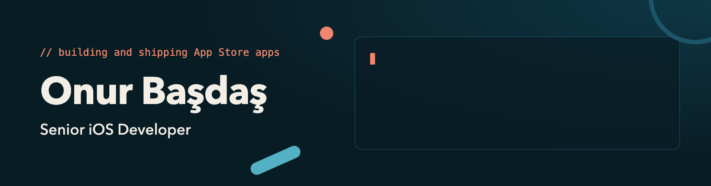
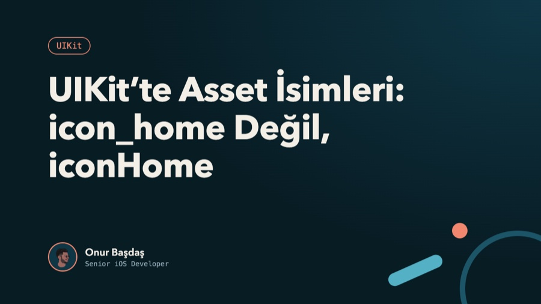
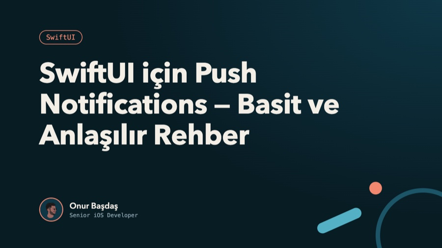
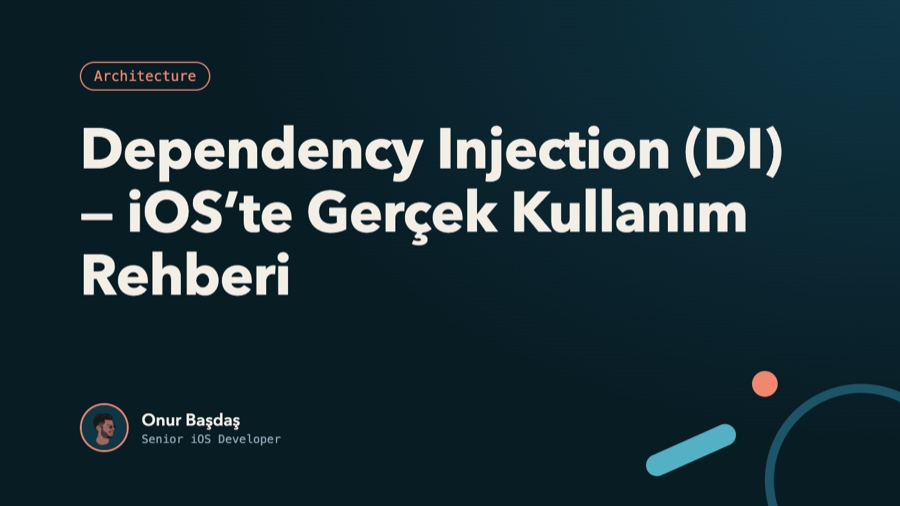
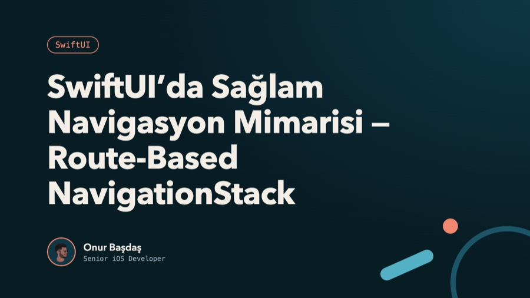

**Senior iOS Developer** based in Istanbul, with 5+ years of experience building and shipping App Store apps. I've built features for a large-scale travel platform, a content-driven news app and enterprise banking, working end-to-end with product, design and backend teams. I care about clean, testable code and scalable, maintainable architecture.

### Latest articles

  
  

  
  

  <a href="https://medium.com/@onurbasdas">All articles on Medium</a> ·
  <a href="https://www.linkedin.com/in/onur-basdas/">LinkedIn</a> ·
  <a href="https://onurbasdas-blog.vercel.app">Resume</a> ·
  <a href="mailto:onurbasdas5@gmail.com">onurbasdas5@gmail.com</a>

